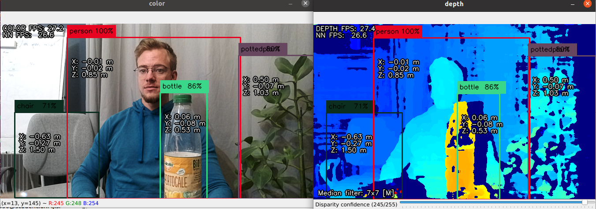
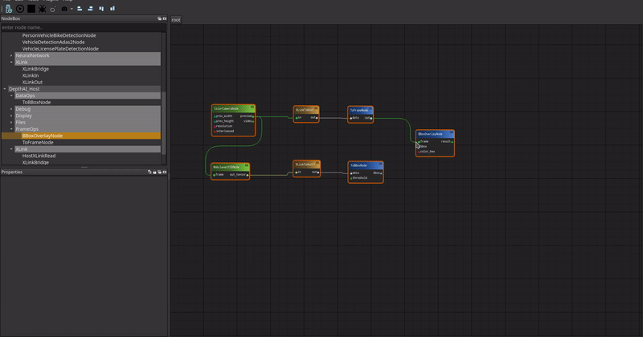
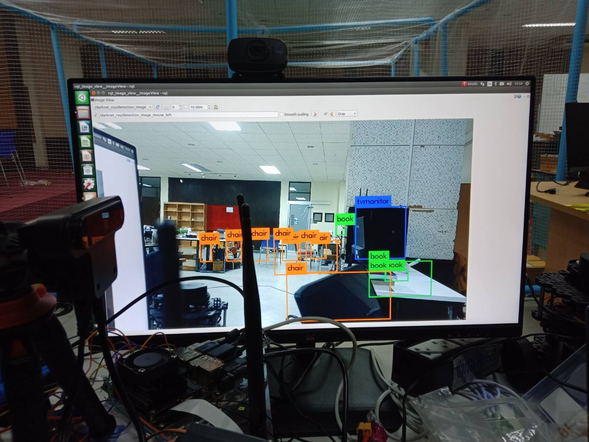

# OAK-D
###### BUY : https://store.opencv.ai/products/oak-d
###### credit web site  : https://docs.luxonis.com/en/latest/

## example

### depthai_hand_tracker : example
###### credit : https://github.com/geaxgx/depthai_hand_tracker
<p align="center">

</p>

###### credit(gif) : https://github.com/geaxgx/depthai_hand_tracker/tree/main/examples/3d_visualization

### depthai_blazepose : example
###### credit : https://github.com/geaxgx/depthai_blazepose
<p align="center">

</p>

### depthai : demo
###### credit : https://github.com/luxonis/depthai.git
<p align="center">

</p>

### depthai-gui
###### credit : https://github.com/luxonis/depthai-gui
<p align="center">

</p>

## ROS
https://github.com/luxonis/depthai-ros

***important***
```
sudo wget -qO- https://raw.githubusercontent.com/luxonis/depthai-ros/noetic-devel/install_dependencies.sh | sudo bash
```
make it install in opencv3+ or opencv4+
### ROS OAK-D detect object
##### https://github.com/leggedrobotics/darknet_ros
###### darknet_ros/darknet_ros/config/ros.yaml
```
subscribers:

  camera_reading:
    topic: /rgb_publisher/color/image
    queue_size: 1
```
darknet_ros/darknet_ros/launch/darknet_ros.launch
```
 <arg name="image" default="/rgb_publisher/color/image" />
 ```
 ```
 <remap from="/rgb_publisher/color/image"  to="$(arg image)" />
 ```
 run
 ```
 roslaunch depthai_examples rgb_publisher.launch
 ```
 ```
 roslaunch darknet_ros darknet_ros.launch
 ```
 fix BGR to RGB
 darknet_ros/darknet_ros/src/YoloObjectDetector.cpp
 ```
 cvImage.encoding = sensor_msgs::image_encodings::RGB8;
 ```
 ```
 cam_image = cv_bridge::toCvCopy(imageAction, sensor_msgs::image_encodings::RGB8);
 ```
 <p align="center">

</p>
